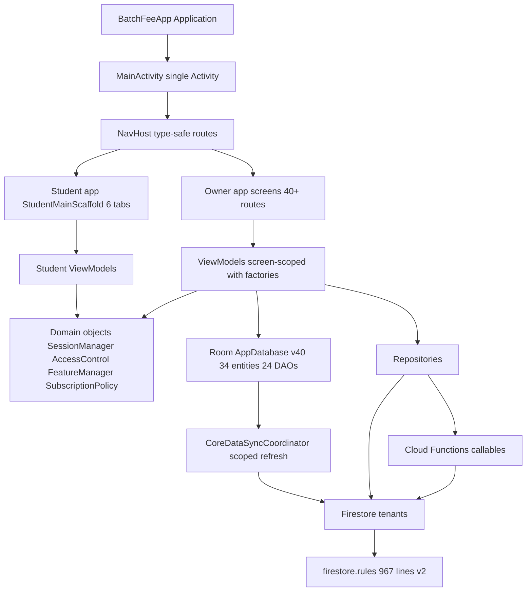

# BatchFee — Complete Codebase Audit & Architecture Map

**Audit date:** 2026-09-04
**Mode:** Architect — read-only analysis, no code changes
**Baseline:** workspace `d:/batchfee`, version `1.6.3` (versionCode 10)

---

## 1. Project Overview

BatchFee is a SaaS education-management platform for coaching institutes in Bangladesh:

- **Owner/staff app** — institute management (students, batches, fees, attendance, staff, salary, exams, reports).
- **Student app** — embedded in the same APK; students log in with institute-issued credentials to see fees, results, attendance, homework.
- **Backend** — Firebase: Firestore (tenant data), Firebase Auth, Cloud Functions (all privileged mutations), Storage (secure media), App Check (Play Integrity), Crashlytics, Analytics.

### Build & version facts

| Item | Value |
|---|---|
| applicationId / namespace | `com.batchfee.edu` |
| versionName / versionCode | `1.6.3` / `10` |
| minSdk / targetSdk / compileSdk | 24 / 36 / 36 (API 36 ext 1) |
| Kotlin / AGP / KSP | 2.2.10 / 8.13.0 / 2.3.5 |
| Compose BOM / Material3 | 2024.09.00 |
| Navigation Compose | 2.8.9 (type-safe, kotlinx-serialization) |
| Room | 2.7.0 (KSP codegen, `exportSchema = false`) |
| Firebase BOM | 34.12.0 |
| JVM target | 11 |
| Release gate | [`verifyReleaseSigning`](app/build.gradle.kts:86) — release artifacts fail unless a non-debug keystore is configured (no debug fallback) |

---

## 2. Architecture Diagram

### Source layout quirk

Two physical trees exist, but both declare the `com.batchfee.edu` package:

- [`app/src/main/java/com/example/...`](app/src/main/java/com/example) — the original owner app (package rename `com.example` → `com.batchfee.edu` already completed; physical dirs not renamed).
- [`app/src/main/java/com/batchfee/edu/...`](app/src/main/java/com/batchfee/edu) — student app + newer feature modules.

---

## 3. App Entry & Navigation

### [`BatchFeeApp`](app/src/main/java/com/example/BatchFeeApp.kt:20)

- Application-scoped `CoroutineScope(SupervisorJob())`.
- Lazy singleton [`AppDatabase`](app/src/main/java/com/example/data/database/AppDatabase.kt:74).
- Initializes ThemePreferences, FirebaseApp, App Check installer, Crashlytics, Firestore (persistence + unlimited cache).
- Debug-only demo seeding (`superadmin@batchfee.app`).
- Coil `ImageLoaderFactory` with [`SecureMediaInterceptor`](app/src/main/java/com/batchfee/edu/data/media/SecureMediaInterceptor.kt).

### [`MainActivity`](app/src/main/java/com/example/MainActivity.kt:53) — 1004 lines, single-activity

- Session-driven navigation: `SessionManager.currentUserId` / `StudentSessionManager.studentId` decide start destination (`AuthRoute` or `StudentDashboardRoute`).
- 20-minute inactivity timeout, Firebase `AuthStateListener` for external sign-outs, subscription-expiry polling every 60s, `lastActiveAt` heartbeats to Firestore.
- Force-update gate ([`ForceUpdateChecker`](app/src/main/java/com/example/domain/ForceUpdateChecker.kt)).
- [`InstituteRealtimeSyncManager`](app/src/main/java/com/example/data/firestore/InstituteRealtimeSyncManager.kt) starts per logged-in tenant.
- Back-handler recovery for restored detail destinations.

### Routes

All routes in [`Routes.kt`](app/src/main/java/com/example/ui/navigation/Routes.kt:5) — ~80 type-safe `@Serializable` routes covering:

Auth, Legal, Dashboard, SuperAdmin, SubscriptionExpired, Pricing, Billing, Students, Archived/All Archives, Batches, Attendance, Fees (dashboard/create/collect/due/receipt/unified), Reports, Reminders, Staff, Staff Activity, Teacher Class Sessions, Routine/Custom Routine, Staff Attendance, Salary, Expenses, Profit/Loss, Exams, Final Exams, ID Cards, Birthdays, Backup/Restore, Audit Log, Enquiries, Settings, Student Registration, Student Login/Dashboard, Works, Homework, Assignments.

### Student app scaffold

[`StudentMainScaffold`](app/src/main/java/com/batchfee/edu/ui/studentapp/StudentMainScaffold.kt:52) — string-route NavHost with 6 bottom tabs: Home, Work, Fees, Attend, Results, Profile; plus documents, homework, and work screens. Sends sparse activity telemetry via [`StudentActivityTracker`](app/src/main/java/com/batchfee/edu/data/activity/StudentActivityTracker.kt).

---

## 4. Data Layer (Room + Firestore)

### Room schema — [`AppDatabase`](app/src/main/java/com/example/data/database/AppDatabase.kt:33)

- **Version 40**, migrations 7→40 all present (no destructive fallback in release; debug builds allow it).
- **34 entities** — institutes, users, subscription plans, students, batches, batch_students, attendance, fees, payments, receipts, payment reversals, financial outbox, deletion outbox, reminders, staff, staff attendance, salaries, teaching sessions, expenses, exams, results, audit logs, absent messages, bulk message logs, enquiries, works, homework, assignments + submissions, final exams (3 tables), custom routines (2 tables).
- **24 DAOs**, indexed for institute-scoped queries; unique business-key indexes on fees/payments/receipts.
- Notable integrity design: `businessKey`/`operationId` + `ledgerVersion` columns, outbox tables ([`FinancialOutboxEntity`](app/src/main/java/com/example/data/models/FinancialOutboxEntity.kt), [`DeletionOutboxEntity`](app/src/main/java/com/example/data/models/DeletionOutboxEntity.kt)) for replay-until-acknowledged remote operations.

### Sync design — [`CoreDataSyncCoordinator`](app/src/main/java/com/example/data/firestore/CoreDataSyncCoordinator.kt:23)

- **Server-confirmed entitlement before any protected query** — cached Room state is never used to authorize a refresh.
- [`CoreDataSyncPolicy`](app/src/main/java/com/example/data/firestore/CoreDataSyncPolicy.kt) builds a per-role/per-permission sync plan.
- Full institute refresh + narrow per-screen `InstituteRefreshScope` refreshes; Room renders first, cloud updates land in background.
- Realtime listener policy ([`RealtimeListenerPolicy`](app/src/main/java/com/example/data/firestore/RealtimeListenerPolicy.kt)) governs which collections get live listeners per role.
- Financial operations and deletions replay from outboxes via [`FeeCollectionRepository`](app/src/main/java/com/example/data/repository/FeeCollectionRepository.kt) and [`SafeDeletionRepository`](app/src/main/java/com/example/data/repository/SafeDeletionRepository.kt).

### Repositories

Owner-side: FeeCollection, SafeDeletion, EntitledCreation (backend-entitled create), Subscription, PlatformAdmin, ExamFee, InstituteOwnerLoginActivity, Permanent purge repositories.
Student-side: StudentAccount, StudentAuth, StudentData (direct Firestore reads for the read-only student surface), StaffAuth, Work sync helpers.

---

## 5. Domain & ViewModels

### Domain layer ([`app/src/main/java/com/example/domain`](app/src/main/java/com/example/domain))

| Component | Responsibility |
|---|---|
| [`SessionManager`](app/src/main/java/com/example/domain/SessionManager.kt:9) | Owner/staff session, 20 min inactivity timeout, StateFlow-based, Firebase sign-out on logout |
| [`StudentSessionManager`](app/src/main/java/com/batchfee/edu/domain/StudentSessionManager.kt:20) | Student session restored only from Firebase custom claims + live UID-linked student doc; no SharedPreferences persistence; live access listener kills disabled/archived student sessions |
| [`AccessControl`](app/src/main/java/com/example/domain/StaffAccess.kt:61) | Route-level permission map; 17 staff permission tokens; admin-only routes |
| `FeatureManager` | Feature gates |
| `SubscriptionPolicy` / `MonthlyDueCalculator` / `StudentBillingSummaryCalculator` | Billing rules |
| `PasswordHasher`, `BiometricAuthManager`, `DataExporter`, `BulkMessageQueue`, `ThemePreferences`, `ForceUpdateChecker`, `InstituteCodeGenerator` | Utilities |

### ViewModels

~22 ViewModels, all pattern: `class XViewModel(private val db: AppDatabase) : ViewModel()` with a matching `XViewModelFactory`. Key ones:

- [`AuthViewModel`](app/src/main/java/com/example/ui/auth/AuthScreen.kt:74) — owner/staff/demo login via StaffAuthRepository.
- [`FeeViewModel`](app/src/main/java/com/example/ui/fees/FeeViewModel.kt:73) — fee creation/collection via FeeCollectionRepository (server-committed).
- [`StudentViewModel`](app/src/main/java/com/example/ui/students/StudentViewModel.kt:34), [`StaffViewModel`](app/src/main/java/com/example/ui/staff/StaffViewModel.kt:28), [`BatchViewModel`](app/src/main/java/com/example/ui/batches/BatchViewModel.kt:26) — use `EntitledCreationRepository` (backend-enforced limits).
- [`AttendanceViewModel`](app/src/main/java/com/example/ui/attendance/AttendanceViewModel.kt:103), [`StaffAttendanceViewModel`](app/src/main/java/com/example/ui/staff/StaffAttendanceScreen.kt:97), [`SalaryViewModel`](app/src/main/java/com/example/ui/staff/SalaryViewModel.kt:24), [`ExamViewModel`](app/src/main/java/com/example/ui/exams/ExamViewModel.kt:33), [`FinalExamViewModel`](app/src/main/java/com/example/ui/exams/FinalExamViewModel.kt:39), [`ExpenseViewModel`](app/src/main/java/com/example/ui/expenses/ExpenseViewModel.kt:26), [`ReportsViewModel`](app/src/main/java/com/example/ui/reports/ReportsViewModel.kt:40), [`ProfitLossViewModel`](app/src/main/java/com/example/ui/reports/ProfitLossViewModel.kt:13), [`RegistrationListViewModel`](app/src/main/java/com/example/ui/registrations/RegistrationListViewModel.kt:29), [`PricingViewModel`](app/src/main/java/com/example/ui/pricing/PricingScreen.kt:88), [`BillingViewModel`](app/src/main/java/com/example/ui/billing/BillingScreen.kt:69), [`SuperAdminViewModel`](app/src/main/java/com/example/ui/superadmin/SuperAdminScreen.kt:250).
- Student-side: [`StudentLoginViewModel`](app/src/main/java/com/batchfee/edu/ui/studentapp/StudentLoginViewModel.kt:22), [`StudentDashboardViewModel`](app/src/main/java/com/batchfee/edu/ui/studentapp/StudentDashboardViewModel.kt:33), [`WorksViewModel`](app/src/main/java/com/batchfee/edu/ui/works/WorksViewModel.kt:18).

---

## 6. UI Layer

- Single dark theme in [`app/src/main/java/com/example/ui/theme`](app/src/main/java/com/example/ui/theme) (DashboardBg `#07111F`, CardBg `#0F172A`, Cyan `#22D3EE`, ElectricBlue `#3B82F6`).
- Shared components: [`BatchFeeBottomNav`](app/src/main/java/com/example/ui/components/BatchFeeBottomNav.kt), [`AnimatedGlowBorder`](app/src/main/java/com/example/ui/components/AnimatedGlowBorder.kt), [`FeatureGuard`](app/src/main/java/com/example/ui/components/FeatureGuard.kt), [`PhoneInputField`](app/src/main/java/com/example/ui/components/PhoneInputField.kt), `BulkMessageComponents`, `SquarePhotoCropDialog`.
- Dashboard = [`DashboardTabsScreen`](app/src/main/java/com/example/ui/dashboard/DashboardScreen.kt:317) with in-memory tab switching between Dashboard and More; all other destinations are NavHost routes gated by `AccessControl`.
- PDF generators: routine, custom routine, money receipt, student admission form, student report, student documents.
- Some screens are large (e.g., [`StaffAttendanceScreen`](app/src/main/java/com/example/ui/staff/StaffAttendanceScreen.kt:1) is ~1139 lines with two tabs: Administration + Teacher Attendance with class-count dialogs and pay auto-calc).

---

## 7. Auth & Security Model

1. **Owner/staff** — Firebase Auth (REST via [`FirebaseAuthApi`](app/src/main/java/com/example/data/firebase/FirebaseAuthApi.kt:14) for user provisioning) + managed `app_users` records; staff login via backend callable `loginStaff`.
2. **Students** — `loginStudent` callable issues short-lived custom claims (`student`, `studentId`, `instituteId`, `studentSessionExpiresAt`); rules bind claims to a UID-linked student document.
3. **Entitlement** — `currentPeriodEndMs` is backend-authoritative; checked client-side (with Room offline fallback), in rules, and in every callable.
4. **Staff permissions** — comma-separated token string validated token-wise in rules and mirrored by `AccessControl`.
5. **App Check** — Play Integrity provider installed; callable `enforceAppCheck: false` while the Play Console link is pending (every callable still does its own auth/role checks).
6. **Media** — [`SecureMediaInterceptor`](app/src/main/java/com/batchfee/edu/data/media/SecureMediaInterceptor.kt) (Coil) + `uploadSecureMedia`/`getSecureMediaUrl` callables (signed URLs, ownership tracking).

---

## 8. Firebase Backend

### Cloud Functions ([`functions/src/index.js`](functions/src/index.js:1) — 2359 lines)

- Node 22, firebase-admin 14, firebase-functions v2, region `asia-south1`.
- ~40 exports. Highlights: `provisionStudentAccount`, `loginStudent`, `provisionStaffAccount`, `loginStaff`, entitled creates (`createEntitledStudent/Batch/Staff`), `commitFinancialOperation`, `commitSubscriptionOperation`, `commitPlatformAdminOperation`, `commitSafeDeletion`, `permanentlyPurgeStudent/Batch/Staff/Institute`, `uploadSecureMedia`, `getSecureMediaUrl`, `submitPublicRegistration`, `createExamWithFees`, activity feeds, operational summaries.
- Scheduled jobs: `expireElapsedSubscriptions` (every 15 min), `cleanupInstituteOwnerLoginActivity` (daily 03:15 Asia/Dhaka).
- Supporting modules: financialLedger(+Core), examFeeBilling, mediaSecurity(+Core), safeDeletion(+Core), permanent purges, publicRegistration(+Core), registrationPhoto, subscriptionBilling(+Core), subscriptionMaintenanceCore, platformAdmin, studentActivity, instituteOwnerLoginActivity, tenantOperationalSummary(+Core), studentAuthCore, studentIdCore, trustedCreationCore, operationalTelemetryCore, defaultSubscriptionPlans, subscriptionPolicy, legacyStudentCredentialCleanup.

### Security rules — [`firestore.rules`](firestore.rules:1) (967 lines)

- v2 rules; role helpers (`isSuperAdmin`, `isManagedInstituteOwner/Admin`, `isActiveStaff`, `hasStaffPermission`, `hasActiveSubscription`).
- Student access requires live custom claims + institute entitlement + UID-linked student document.
- Emulator-tested: **41/41 rules tests passing** ([`tests/firestore.rules.test.cjs`](tests/firestore.rules.test.cjs)).

### Indexes

[`firestore.indexes.json`](firestore.indexes.json:1) — one composite index on `institutes(subscriptionStatus, currentPeriodEndMs)` used by the expiry sweep.

---

## 9. Testing & Quality Gates

- **Backend:** 90/90 unit/load tests passing (`node --test`); syntax check script covers all modules.
- **Android unit tests:** migration tests (financial ledger, safe deletion, student credentials), FeeCollectionRepositoryTest, SafeDeletionRepositoryTest, CoreDataSyncPolicyTest, RealtimeListenerPolicyTest, SessionManagerTest, MonthlyDueCalculatorTest, StudentBillingSummaryCalculatorTest, StudentIdGeneratorTest, MessageTemplateStoreTest, InstituteContactNumberTest, PhoneInputFieldTest, StudentOperationalCountTest (Robolectric + Roborazzi configured).
- **Local release gate:** [`scripts/v17-release-gate.ps1`](scripts/v17-release-gate.ps1) — verified on 2026-08-31 (all passes documented in [`docs/V1.7_LOCAL_RELEASE_GATE_REPORT.md`](docs/V1.7_LOCAL_RELEASE_GATE_REPORT.md:1)).
- Remaining pre-production steps: staging deploy + load tests, Play Console cloud-project link for App Check enforcement, Play testing track rollout, 7-day crash-free observation.

---

## 10. Current State & Observations

1. **Status vs the 2026-08-08 master audit:** the P0 surface has been substantially remediated — rewritten rules with backend authority, custom-claim student auth, managed `app_users` roles, signed secure media, outbox-based finance with server commit, gated release signing, App Check installed. [`MASTER_PRODUCTION_AUDIT_2026-08-08.md`](MASTER_PRODUCTION_AUDIT_2026-08-08.md:7) remains the historical baseline.
2. **Known recency item:** the Staff Attendance Teacher-tab restructure (["stuck state" report](plans/staff-attendance-stuck-state-report.md:1)) — the previously-failing region around line 712 of [`StaffAttendanceScreen.kt`](app/src/main/java/com/example/ui/staff/StaffAttendanceScreen.kt:712) now reads coherently; the user reported completion of prior tasks, and no other half-edited file was found.
3. **Notable technical debts:** `exportSchema = false` (no Room schema JSON), physical `com/example` vs logical `com.batchfee.edu` package split, several very large composables (Dashboard, Auth, StaffAttendance, SuperAdmin screens), README staleness, `FirebaseAuthApi` embeds a REST API key and still handles some direct REST auth for provisioning.
4. **Docs corpus** tracks 12 problem-audits (`docs/problem-01` … `docs/problem-12`) plus P0 remediation records; those are the historical audit trail.

---

## 11. Ready State

Architecture is fully mapped: UI → ViewModel → Repository/Domain → Room cache + Firestore sync → Cloud Functions authority → rules enforcement. Ready to receive the next task.
